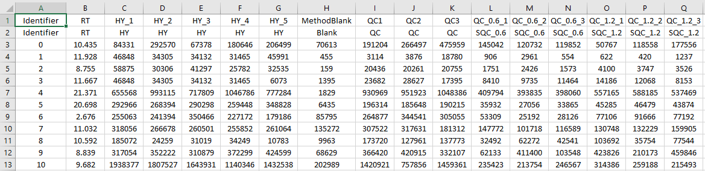

# MAFFIN

## Overview

MAFFIN is an integrated R package for metabolomics sample normalization. MAFFIN main algorithm consists of three modules, **high-quality feature selection, MS signal intensity correction, and maximal density fold change normalization**. This package also implements commonly used normalization methods and normalization evaluation functions.

## Installation

**Check if R package "devtools" is installed.**
```
# If not, install R package "devtools" first
install.packages("devtools")
```

**Install MAFFIN**
```
devtools::install_github("Waddlessss/MAFFIN")
```

## Usage

### Input

MAFFIN takes feature intensity table (dataframe) as input, with features in row and samples in column by default. 

Specifically, the column names are sample names. The first row includes sample group names. The input feature intensity table can be prepared in .csv format. Your input data table should be similar to this:

  

An example input data table can also be viewed in R:
```
# View the example input data table
View(TestingData)
```

In the first row, you need to label samples by their group names. In particular,
- use **blank** for blank samples
- use **RT** for retention time
- use **QC** for normal QC samples
- use **SQC_###** for serial QC samples, where **"###"** means their relative loading amounts. For example, "SQC_1", "SQC_2" and "SQC_3" mean serial QC samples with loading amounts of 1, 2 and 3 uL, respectively.

Note, the group names of real biological samples cannot be any above.

After preparing the input feature intensity table, you are ready to read it to R.

```
# Read the input feature intensity table in .csv format.
inputTable = read.csv(filename)
# Using testing data as input
# inputTesting = TestingData
```

### MAFFIN main function
```
# Sample normalization using MAFFIN main function
MAFFINTable = MAFFINNorm(inputTable)
```

### Output
The function `MAFFINNorm` returns a list contains 4 items.
- `NormedTable` is the normzalized feature intensity table (data frame) with extra columns of the data processing results.
- `NormFactor` is a named numeric vector of calculated normalization factors. Normalization factor reflects the relative concentrations of biological samples.
- `OriPRMAD` is a numeric vector of PRMADs from original data before normalization (but after MS intensity correction).
- `NormedPRMAD` is a numeric vector of PRMADs from normalized data.

In particular, three columns are added in `NormedTable` compared to the input.
- `Quality` labels the feature quality. For low-quality features, MAFFIN elaborates the reasons including Blank, RT, LowRSD, and LowCor corresponding to four feature selection criteria.
- `Model` indicates the regression model for MS intensity correction.
- `SQC_points` indicates the number of detected serial QC data that were used in MS intensity correction.

More descriptions are provided in R.
```
# Find more descriptions of MAFFIN output
?MAFFINNorm()
```

### Other normalization functions
```
# Sum normalization
SumNormedTable = SumNorm(inputTable)

# Median normalization
MedianNormedTable = MedianNorm(inputTable)

# Quantile normalization
QuantileNormedTable = QuantileNorm(inputTable)

# Probabilistic quotient normalization
PQNNormedTable = PQNNorm(inputTable)
```

### Normalization evaluation
MAFFIN package uses intragroup variation to evaluate the normalization results. The lower intragroup variation means better sample normalization.
```
# Calculate pooled RMAD for normalization evaluation.
prmad = EvaPRMAD(TestingData, GroupNames=c("HY", "SX", "SW", "YC"))

# Calculate pooled RSD for normalization evaluation.
prsd = EvaPRMAD(TestingData, GroupNames=c("HY", "SX", "SW", "YC"))
```

## Citation
Yu, H., & Huan, T. (**2021**). MAFFIN: Metabolomics Sample Normalization Using Maximal Density Fold Change with High-Quality Metabolic Features and Corrected Signal Intensities. *bioRxiv*.
